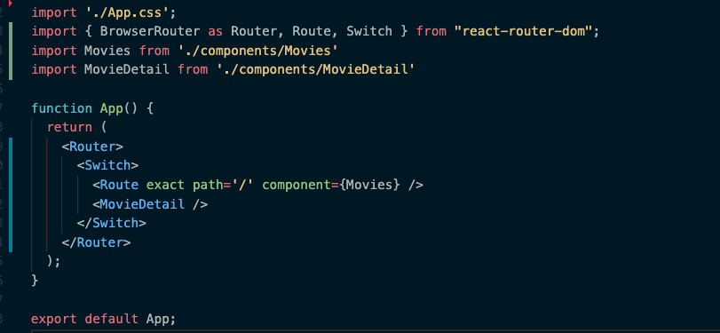
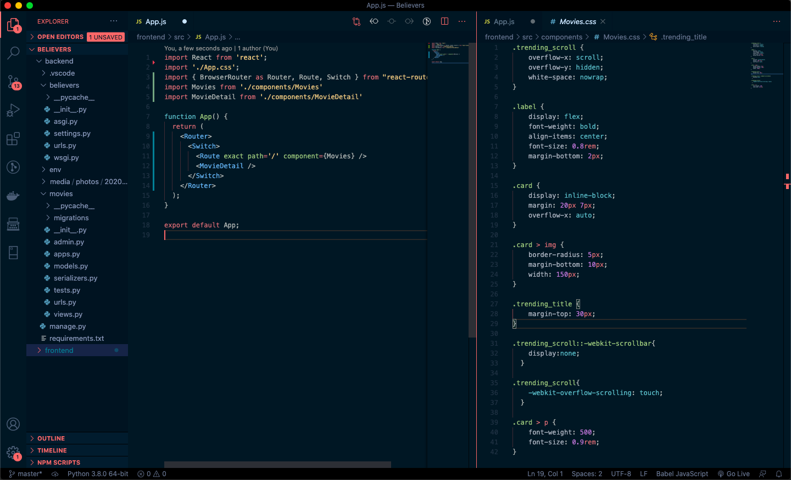
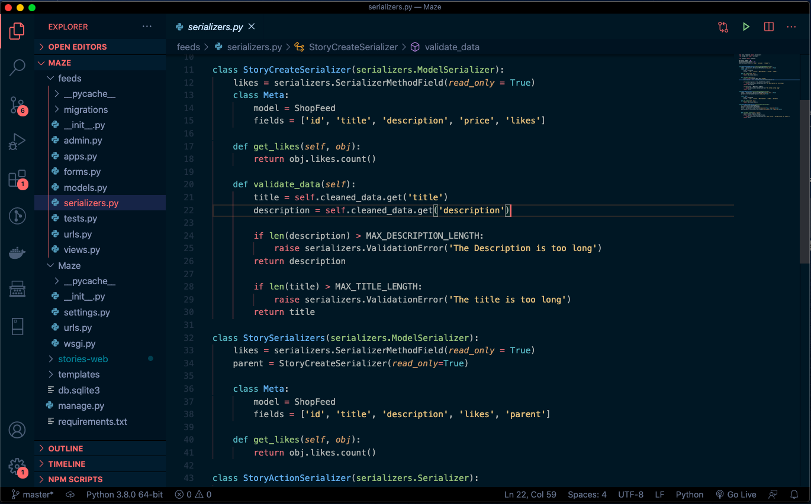

<h1 align="center">
  WildWest for Visual Studio Code 
</h1>

  

&nbsp;
 

&nbsp;
 

<h3 align="center">
  Dark and high contrast theme
</h3>

  WildWest is a dark theme that has a strong color contrast with a dark background.

&nbsp;
 

  

&nbsp;
 

&nbsp;
 

### Installation via VS Code
1. In VS Code open **Extensions** in sidebar
2. Search for **WildWest**
3. Click **Install**
4. Reload the editor
5. Code > Preferences > Color Theme > WildWest

&nbsp;
 

&nbsp;

&nbsp;
 

&nbsp;
 

